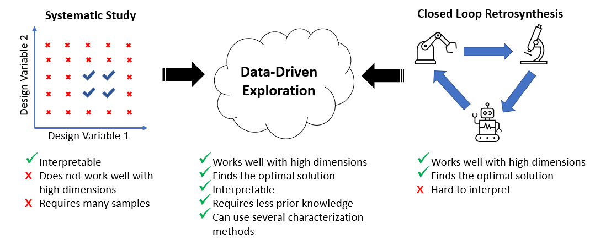

## Data and Code: Data-Driven Exploration of Silver Nanoplate Formation in Multidimensional Chemical Design Spaces

This repository contains the code and data for the above-mentioned paper. This includes UV-Vis spectra, SAXS scattering curves, TEM images, code for the gaussian process classifier, the distance metric, and all other information. 

### Organization of the Files and Folders
In this repository there are four folders, each folder has sub-folders contained data, code, or figures. The files and folders labeled "Shape Exploration" refer to the first part of the paper where the objective was to determine what experimental design parameters lead to plate-like particles. The ones labeled "Size Exploration" refer to the second part of the paper where the objective was to determine how the experimental design parameters affect the size and polydispersity of the plates. The files and folders are organized in the following way: (Folders are in **bold**)

- **Figures:** This folder contains all the figures used in the paper
- **Notebooks:** This folder contains the code used in the paper, which were written in jupyter notebooks. The notebooks are:
  - Shape Exploration - Figures: Contains the code to create the figures in the shape exploration part of the paper
  - Shape Exploration - Phase Mapping: Contains code used to determine whether a sample was a "plate" or "not plate"
  - Shape Exploration - Gaussian Process Classifier: Contains the code used to train the gaussian process classifier and to draw samples for the next iteration
  - design_space.py: Python file that contains additional code used to run the gaussian process classifier and determine the targeted design space
  - Size Exploration - Figures: Contains code used to create the figures in the size exploration part of the paper
  - Size Exploration - SHAP: Contains code used to create the SHAP plots
  - Size Exploration - SAXS Fitting: Contains code used to autonomously fit SAXS data 
- **Shape Exploration:** This folder contains data used in the shape exploration part of the paper
  - **Spectra:** Contains the experimental spectra (in .xlsx format) and their classification (in .npy format) of all the iterations. Also contains the simulated spectra of the spheres and plates (in .xlsx format). The spectra files in .xlsx format contain an array of data where the first column is the wavelength in nanometers. The other columns are the UV-Vis extinction spectrum in arbitrary units of each sample in the order that they were taken. This order is consistent with the order that the samples are listed in the Volumes.csv files with the same iteration number. The classification.npy files contain either a 0 (not plate) or 1 (plate) which is the label that was given to each sample. They are cumulative, so classification_5.npy contains the labels for all the 288 samples that were synthesized. The folder **Simulations** contains the extinction spectra of the plates and spheres that were simulated using nanoDDSCAT. 
  - **Volumes:** Contains the volumes of all the samples in microliters used in each of the iterations in .csv format. Each column represents a reagent, and each row represents a sample.
- **Size Exploration:** This folder contains data used in the size exploration part of the paper
  - **SAXS:** Contains all the SAXS related data 
    - **Data:** Contains the SAXS data in .DAT format. Each file contains the data for a single sample from 137 of the samples that were classified as plates from Shape Exploration. The first column in the file is the scattering vector ,q, in units of inverse angstrom, the second column in the intensity in arbitrary units, and the thrid column is the uncertainty. 
    - **Fits:** Contains images of the fits of all the data using either a polydisperse plate model or a plate and sphere model
    - Volumes_and_Structure.xlsx: An excel sheet that contains the name of each sample, the volumes used to create the sample in microliters, the structural parameters of each sample determined by SAXS in nanometers (P_length, P_radius, S_radius) and unitless (P_radius_PD, P_scale, S_scale), and the peak wavelength of each sample determined by UV-vis in nanometers. This folder only contains the samples that were classified as plates. 
  - **TEM:** Contains images of the nanoparticles
    - **Plate_Sample:** Contains images of the sample that was fit using the polydisperse plate SAXS model
    - **Plate_and_Sphere_Sample:** Contains images of the sample that was fit using the polydisperse plate and sphere SAXS model

### Requirements
Most of the code was written in python using common libraries (pandas, numpy, scipy, scikit-learn, matplotlib, shap). Additional libraries include the one for the amplitude-phase distance metric (https://github.com/pozzo-research-group/HEAD/tree/BO) and for sasmodels (https://pypi.org/project/sasmodels/).
