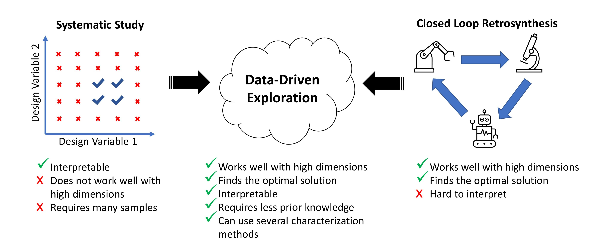

## Data and Code: Data-Driven Exploration of Silver Nanoplate Formation in Multidimensional Chemical Design Spaces

This repository contains the code and data for the above-mentioned paper. This includes UV-Vis spectra, SAXS scattering curves, TEM images, code for the gaussian process classifier, the distance metric, and all other information. 

  

### Organization of the Files and Folders
In this repository there are four folders, each folder has sub-folders that contains data, code, or figures. The files and folders labeled "Fast Spectroscopic Exploration" refer to the first part of the paper where the objective was to determine what experimental design parameters lead to plate-like particles. The ones labeled "SAXS Structural Exploration" refer to the second part of the paper where the objective was to determine how the experimental design parameters affect the size and polydispersity of the plates. The files and folders are organized in the following way: (Folders are in **bold**)

- **Figures:** This folder contains all the figures used in the paper
- **Notebooks:** This folder contains the code used in the paper, which were written in jupyter notebooks. The notebooks are:
  - Fast Spectroscopic Exploration - Figures: Contains the code to create the figures in the fast spectroscopic exploration part of the paper
  - Fast Spectroscopic Exploration - Classification: Contains code used to determine whether a sample was a "plate" or "not plate"
  - Fast Spectroscopic Exploration - Gaussian Process Classifier: Contains the code used to train the gaussian process classifier and to draw samples for the next iteration
  - design_space.py: Python file that contains additional code used to run the gaussian process classifier and determine the targeted design space
  - data_merge.py: Python file that contains code used to merge SAXS data of different configurations
  - SAXS Structural Exploration - Figures: Contains code used to create the figures in the SAXS Structural Exploration part of the paper
  - SAXS Structural Exploration - SHAP: Contains code used to create the SHAP plots
  - SAXS Structural Exploration - SAXS Data Merge: Contains code used to semi-autonomously merge SAXS data of different configurations 
  - SAXS Structural Exploration - SAXS Fitting: Contains code used to autonomously fit SAXS data 
- **Fast Spectroscopic Exploration:** This folder contains data used in the fast spectroscopic exploration part of the paper
  - **Spectra:** Contains the experimental spectra (in .xlsx format) and their classification (in .npy format) of all the iterations. Also contains the simulated spectra of the spheres and plates (in .xlsx format). The spectra files in .xlsx format contain an array of data where the first column is the wavelength in nanometers. The other columns are the UV-Vis extinction spectrum in arbitrary units of each sample in the order that they were taken. This order is consistent with the order that the samples are listed in the Volumes.csv files with the same iteration number. The classification.npy files contain either a 0 (not plate) or 1 (plate) which is the label that was given to each sample. They are cumulative, so classification_5.npy contains the labels for all the 288 samples that were synthesized. The folder **Simulations** contains the extinction spectra of the plates and spheres that were simulated using nanoDDSCAT. 
  - **Volumes:** Contains the volumes of all the samples in microliters used in each of the iterations in .csv format. Each column represents a reagent, and each row represents a sample.
- **SAXS Structural Exploration:** This folder contains data used in the SAXS Structural exploration part of the paper
  - **SAXS:** Contains all the SAXS related data 
    - **Raw Data:** Contains SAXS data that has been subtracted with the XSCAT software, but not merged. The folders are named according to their sample name. Each folder contains three files, one for each SAXS configuration.  
    - **Merged Data:** Contains SAXS data in .DAT format. Each file contains the data for a single sample from 137 of the samples that were classified as plates from Fast Spectroscopic Exploration.  The first column in the file is the scattering vector ,q, in units of inverse angstrom, the second column in the intensity in arbitrary units, and the thrid column is the uncertainty. 
    - **Fits:** Contains images of the fits of all the data using either a polydisperse plate model or a plate and sphere model
    - Volumes_and_Structure.xlsx: An excel sheet that contains the name of each sample (A1, A2, A3, ...), the volumes used to create the sample in microliters, the structural parameters of each sample determined by SAXS in nanometers (P_length, P_radius, S_radius) and unitless (P_radius_PD, P_scale, S_scale) (P stands for Plate and S stands for Sphere), and the peak wavelength position of each sample determined by UV-vis in nanometers. This folder only contains the samples that were classified as plates, as determined by their UV-Vis spectra. 
  - **TEM:** Contains images of the nanoparticles
    - **Plate_Sample:** Contains microscopy images of the sample that was fit using the polydisperse plate SAXS model
- **OT2-DOE:** Contains all the code used to create and perform the pipetting commands using the OT2 liquid handling robot. This code was adapted from (https://github.com/pozzo-research-group/OT2-DOE)
  - Run OT2.ipynb: A jupyter notebook used to run the pipetting commands 
  - Protocol.xlsx: An excel file that contains information on the postions of the labware in the OT2 robot as well as the pipettes used 
  - **Custom Labware:** Contains the dimensions of the custom labware used in the experiment
  - **Plan:**
    - CreateSamples.py: Code used calculate how many stock solutions are needed and their volumes
  - **Prepare:**
    - OT2Commands.py: Contains most of the code used to create the pipetting commands and code to execute the commands using the OT2 robot 
  - **Volumes:** Contains .csv files of the volumes of the samples that were created in each iteration of the experiment
    

### Requirements
Most of the code was written in python using common libraries ($pandas, numpy, scipy, scikit-learn, matplotlib, shap$). Additional libraries include the one for the amplitude-phase distance metric (https://github.com/pozzo-research-group/HEAD/tree/BO), $sasmodels$ (https://pypi.org/project/sasmodels/) for SAXS data merging and fitting, and $opentrons$ to control the liquid handling robot.
