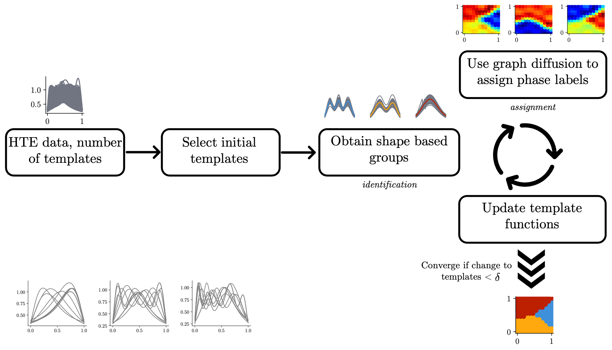

## Automatic Structure Phase Map (autophasemap) generation

This repository host the supporting code for the following paper.
"Metric geometry tools for automatic structure phase map generation" by Kiran Vaddi, Karen Li, and Lilo D Pozzo.

```bibtex
@article{autophasemap, 
	place={Cambridge}, 
 	title={Metric geometry tools for automatic structure phase map generation}, 
 	DOI={10.26434/chemrxiv-2022-3p4gx}, 
 	journal={ChemRxiv}, 
 	publisher={Cambridge Open Engage}, 
 	author={Vaddi, Kiran and Li, Karen and Pozzo, Lilo D}, year={2022}} 
 	This content is a preprint and has not been peer-reviewed.
```



The installation instruction are below for a cluster computer but there are the same for a local computer.
The main difference is that on a cluster computer you need to explicitly load the module `gcc` which would be readily available on your Mac/Windows/Linux OS systems.

## Installing environment on cluster computer

```bash
conda env create --prefix ~/<your_username>/envs/elastic_kmeans --file environment.yml
```

And activate it using:

```bash
conda activate elastic_kmeans
```

You need to install the following:

```bash
pip install numpy Cython cffi
```

Load the gcc module if you are using this on a cluster computer otherwise move to the next step.
```bash
module load gcc
```

And then install the warping package using git : 

```bash
pip install git+https://github.com/kiranvad/warping.git
```

Finally, the `autophasemap` can be installed using:

```bash
pip install -e .
```

A simple example using a synthetic Gaussian functions as an example can be found in [this notebok](expts/Gaussians/gaussian_peaks.ipynb). This example can be run on your local machine once the `autophasemap` package is installed using the similar instructions as above.

## Guide to access data and notebooks for case studies in the paper

In the paper, there are three case studies (two with SAXS and one with XRD). The data for XRD has been kindly provided to us by [Gilad Kusne](https://www.nist.gov/people/aaron-gilad-kusne).
We have generated the expertimental data ourselves via a combination of Federal grants acknowledged in the original paper.

We proivde python and slurm scipts used to produce the results in `/expts/` folder and the visualization scripts with the converged data in `/postprocess/`.

1. [SAXS case study of pluronics with varying temperature](postprocess/P123_Temp/)
	- This folder contains the guidelines to access and rerproduce the plots (Figure 3, 4, 5).
	- Python scripts to reproduce the results on a cluster computer are provided in `/expts/OMIECS/PPBT_0_P123_Y_Temp.py` and the respective slurm batch script in `/expts/slurm_FePdGa.sh`
	- Jupyter notebook to visualize manually annotations can be accessed at `/postprocess/P123_Temp/manual`
	
2. [XRD case study on a benchmark system](postprocess/FeGaPd)
	- This folder contains the guidelines to access and rerproduce the plots (Figure 6).
	- Python scripts to reproduce the results on a cluster computer are provided in `/expts/FeGaPd/FeGaPd_autophasemap.py` and the respective slurm batch script in `/expts/FeGaPd/slurm_blends.sh`	

	
3. [SAXS case study of polymer blends of pluronics and conjugated polymers](postprocess/WSCP_P123_NOpH)
	- This folder contains the guidelines to access and rerproduce the plots (Figure 7).
	- Python scripts to reproduce the results on a cluster computer are provided in `/expts/OMIECS/run_WSCP_p123_NOpH.py` and the respective slurm batch script in `/expts/slurm_blends.sh`

All the notebooks and python scripts are annotated with comments to describe the nature of computation and usage. Fell free to open an issue if any of the files do not work as expected or any content is unclear.


